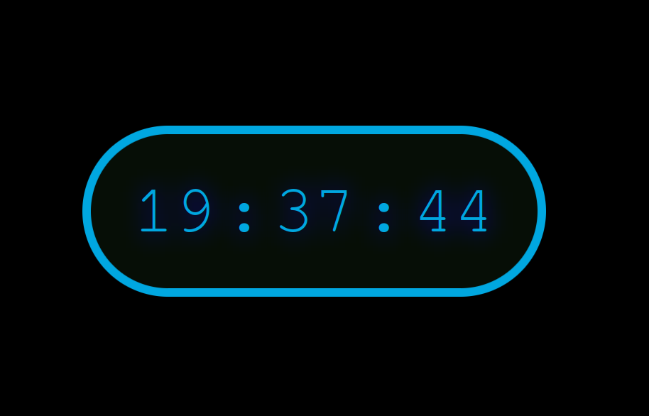
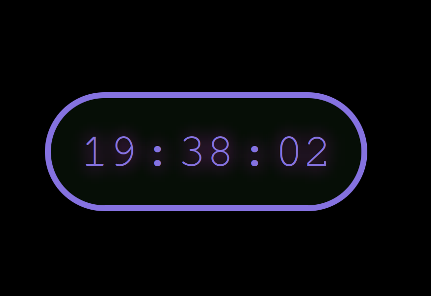

# Digital Clock Project

This project is a **Digital Clock** built with **HTML**, **CSS**, and **JavaScript**. It displays the current time with hours, minutes, and seconds, updating every second in real time. The clock has a neon-like effect with a clean, dark theme. It is fully responsive and can be easily integrated into any web application or personal project.

## Preview





## Features

- Real-time clock showing hours, minutes, and seconds.
- Neon-styled text with customizable color.
- Smooth, continuous updates every second.
- Fully responsive for different screen sizes.
- Clean and minimalistic design with a digital clock look.

## Technologies Used

- **HTML5**: Structure of the clock interface.
- **CSS3**: Styling and layout, including the neon text-shadow effect.
- **JavaScript**: Logic to get the current time and update the clock every second.

## How It Works

1. The **JavaScript** fetches the current time from the system using the `Date()` object.
2. The time is formatted to always show two digits for hours, minutes, and seconds.
3. The **setInterval()** method is used to continuously update the displayed time every 1000 milliseconds (1 second).
4. The **CSS** provides the design, with a dark background and neon-like green text, making the clock look like a digital display.

## How to Run

1. Clone the repository:
   ```bash
   git clone https://github.com/LennoxP/DigitalClock.git
